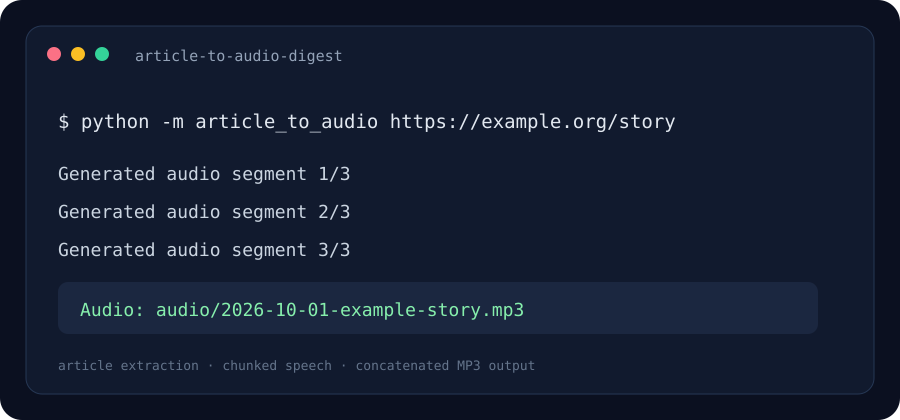

# Article-to-Audio Digest

A command-line tool that extracts the main text from an article URL and turns it into a date-stamped MP3.

> The image above is an illustrative terminal preview.

## Problem it solves

Long articles are awkward to read on the go. This project extracts the article body, splits it into manageable text segments, synthesizes speech, and joins the segments into one audio file.

## Quick start

Requires Python 3.10 or later. MP3 assembly uses FFmpeg; install FFmpeg and make it available on PATH.

~~~powershell
python -m venv .venv
.venv\Scripts\Activate.ps1
python -m pip install -r requirements.txt
python -m article_to_audio https://example.org/article --language en --output-dir audio --text-copy
~~~

Change the language using a gTTS language code, for example es or fr.

## How it works

1. Requests retrieves an HTTP(S) page with a timeout and a response-size limit.
2. Trafilatura extracts the title and main article text while excluding comments.
3. Text is split into bounded chunks for speech synthesis.
4. gTTS returns MP3 segments and pydub/FFmpeg concatenates them into one file.
5. The output name includes the local date and a sanitized article title.

## Project layout

- **article_to_audio/digest.py** — extraction, chunking, and MP3 generation.
- **article_to_audio/cli.py** — command-line options and output paths.
- **assets/preview.svg** — illustrative terminal preview.

## Tech stack

Python · requests · Trafilatura · gTTS · pydub · FFmpeg

## Network and content notes

The article is fetched from its URL, then its extracted text is sent to Google's Text-to-Speech service by gTTS. Do not use this with private or sensitive article text. Respect site access rules and copyright; this tool is for personal accessibility and study workflows. Extraction quality varies by page layout. FFmpeg is a system dependency and is not installed by pip.

## License

MIT.
